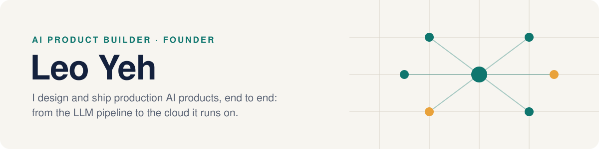
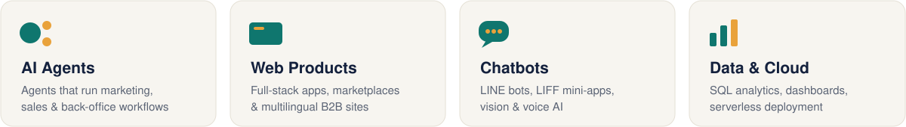

  
  
  

I come from the business side of B2B SaaS (business development, customer success and CRM implementation) and I build AI products myself. I take a product from the problem to production: system design, LLM pipelines, backend, payments, cloud deployment, testing and monitoring.

I work AI-first with Claude Code, but treat the output like production software: typed code, migrations, CI/CD, observability and large automated test suites.

 

## ✨ What I Do

 

## 🚀 Featured Builds

<table>
<tr>
<td width="50%" valign="top">

### [TripDayNDay](https://www.tripdaynday.com/)
**FOUNDER & BUILDER** · MULTILINGUAL AI ASSISTANT ON LINE

Users send a photo, voice note or text in LINE and get a plain-language answer, with optional spoken replies. Built for older adults, so there's no app to install.

- **Multimodal AI:** Gemini 2.5 Flash reads photos (menus, signs, labels); Google Cloud TTS speaks replies
- **Four languages, one backend:** Traditional Chinese, English, Japanese and Thai LINE channels served by a single FastAPI service
- **Full product stack:** Stripe subscriptions and paywall, referral tracking, promo codes, LIFF web front end, auto-generated travel recap videos (moviepy + ffmpeg)
- **Production engineering:** async SQLModel on Cloud SQL PostgreSQL, Alembic migrations, Docker → GitHub Actions → Cloud Run, Sentry + OpenTelemetry tracing
- **2,400+ automated tests** across the codebase

    

</td>
<td width="50%" valign="top">

### [Structaly](https://structaly.com/)
**FOUNDER & BUILDER** · AI ORDER-TAKING FOR B2B SUPPLIERS

Small food and hardware suppliers get orders as casual messages in LINE group chats. Structaly turns them into structured, confirmed orders without asking customers to change how they write.

- **Hybrid parsing engine:** a rule-based gate filters out non-orders at zero LLM cost → the LLM only *copies* text spans (temperature 0) → deterministic code matches items, quantities and dates
- **Design backed by evals:** a golden test set showed LLMs "deciding" orders invented or dropped them, so the model never makes the call
- **"Flag, never guess":** anything uncertain is marked for human review instead of filled with a plausible value
- **Photo orders:** one Vision call both classifies the image and transcribes it
- **Self-learning catalog:** new items are recorded automatically but only trusted after human confirmation
- **Multi-tenant safety:** every database query requires a supplier ID, so there's no way to read across tenants. 400+ tests run in ~3 seconds

    

</td>
</tr>
<tr>
<td colspan="2" valign="top">

### [vediocut](https://github.com/leoai123/vediocut-case-study) &nbsp;📖 CASE STUDY
**BUILDER** · TRANSCRIPT-FIRST AI VLOG EDITOR

Turns a pile of handheld phone clips into a narrative vlog by understanding what was said first, then deciding how to cut, the way a human editor works. Iterated on nine real shoots.

- **Local speech recognition:** whisper.cpp + voice-activity detection + word-level timestamps, fully on-device
- **Correction with world knowledge, not glossaries:** the LLM infers region and topic from the transcript to fix misheard names. In testing this fixed twice as many errors as a hand-built glossary
- **"Radio edit" first:** the story must make sense with the picture off, and cuts land only at sentence ends
- **LLM decides, rules verify:** the edit plan must pass a deterministic validation gate before anything renders
- **B-roll via Chinese-CLIP with human review:** similarity scores alone mislead on similar-looking footage
- **Make failures loud:** silent failures were the costliest bugs, so each one became an explicit check

     

</td>
</tr>
</table>

 

## 🧩 Other Work

| Project | What I built |
|---|---|
| **AI agency for small businesses** | AI agents that automate marketing, sales outreach and back-office workflows. Multilingual B2B websites on Next.js + Sanity CMS, set up so clients edit content themselves. |
| **B2B sourcing platform** | Pipelines that pull manufacturers' full product catalogs from websites and PDFs (including OCR for scanned files) into a structured, searchable supplier database. Next.js + Prisma. |
| **Generative-AI avatar startup** | Led product: roadmap, pricing and partnerships for a virtual-influencer platform. |
| **AI local newsletter** | An AI-edited local newspaper, generated and delivered as a newsletter, one edition per city. |
| **Commuter map** | A map with a social layer, running on Cloudflare Workers. |
| **LINE group game** | A puzzle game played inside LINE group chats with a weekly leaderboard (LIFF + Phaser + Hono). |

 

## 🧭 How I Build

<table>
<tr>
<td width="33%" valign="top">

**⚙️ Deterministic first, LLM second**

Rules handle what rules can. The model only does the part that truly needs language understanding, which keeps cost low and behavior predictable.

</td>
<td width="33%" valign="top">

**🧪 Prove it with evals**

Design choices come from test sets, not intuition. Every important behavior is pinned by an automated test.

</td>
<td width="33%" valign="top">

**🔒 Safe by construction**

Tenant isolation, cost limits and product boundaries are enforced in code, so a future change can't quietly break them.

</td>
</tr>
</table>

 

## 🛠 Toolkit

**AI** &nbsp;

**Backend** &nbsp;

**Frontend** &nbsp;

**Data & Cloud** &nbsp;

**Business** &nbsp;

 

⛰️ Mountaineering (38 of Taiwan's Top 100 Peaks) · 🌊 Free diving

